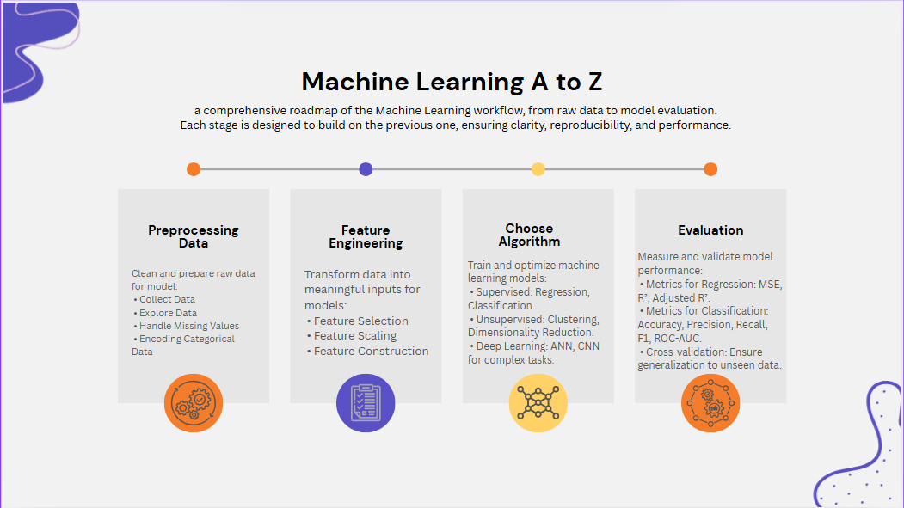

# Machine Learning A to Z

A clear roadmap of the Machine Learning workflow — from raw data preprocessing to model evaluation.
This repository contains Jupyter Notebooks, datasets, and examples covering supervised, unsupervised, and deep learning methods.

---

## Workflow

### 1. Preprocessing Data

1.1 Collect and clean raw data

1.2 andle missing values

1.3 Encode categorical variables

---

### 2. Feature Engineering

2.1 Feature selection (correlation, p-value)

2.2 Feature scaling

2.3 Feature construction

--- 

### 3. Choose Algorithm

3.1 Supervised: Regression, Classification

3.2 Unsupervised: Clustering, Dimensionality Reduction

3.3 Deep Learning: ANN, CNN

---

### 4. Evaluation

4.1 Regression Metrics: MSE, R², Adjusted R²

4.2 Classification Metrics: Accuracy, Precision, Recall, F1

4.3 Cross-validation for generalization

---

### 5. Libraries Used

5.1 NumPy, Pandas → Data handling

5.2 Matplotlib, Seaborn → Visualization

5.3 Scikit-learn → ML models & evaluation

5.4 TensorFlow / Keras → Deep Learning

---

✨ This repository is part of my Spark Internship journey.

✨ Each section is self-contained with code + explanation + dataset.

🤖 Machine Learning is about transforming data into insights through a complete pipeline — from preprocessing to deployment.
